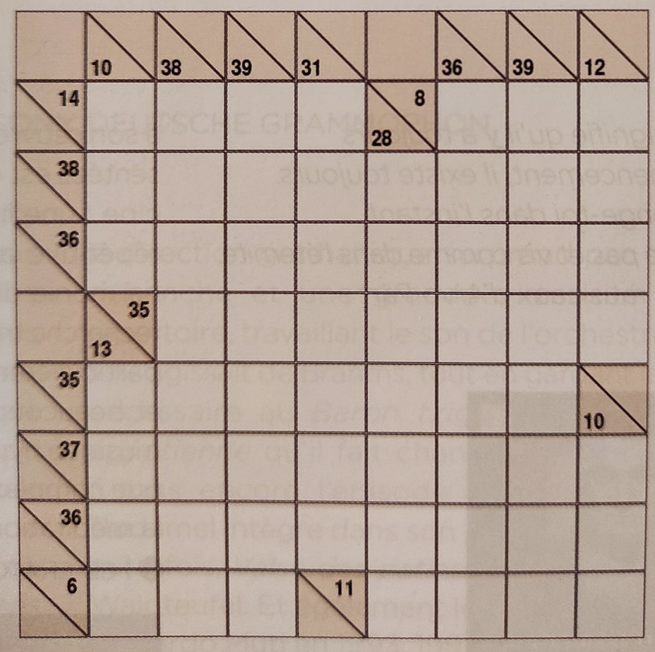

# kakuro.py

Very basic but functional [Kakuro](https://en.wikipedia.org/wiki/Kakuro) solver written in Python. It uses a [reduction](http://forum.enjoysudoku.com/how-to-check-for-unique-solution-in-a-kakuro-puzzle-t33617.html) to [exact set cover](en.wikipedia.org/wiki/Exact_cover_problem) and Ali Assaf's elegant [implementation](https://www.cs.mcgill.ca/~aassaf9/python/algorithm_x.html) of [Knuth's Algorithm X](https://en.wikipedia.org/wiki/Knuth%27s_Algorithm_X).

## Usage

`kakuro.py` can solve the following Kakuro in less than a minute.



```py
from kakuro import solve

pattern = """
0000X000
00000000
00000000
X0000000
0000000X
00000000
00000000
000X0000"""
cols = [10, 13, 38, 39, 31, 28, 36, 39, 12, 10]
lines = [14, 8, 38, 36, 35, 35, 37, 36, 6, 11]
print(next(solve(pattern, cols, lines)))
```

gives

```
14720341
69132854
31267485
05813792
23485670
36974125
78546213
12301532
```

`solve()` is an iterator so you can also use it to check the uniqueness of solutions (however the Kakuro above has more than 100M solutions).

Note: the current code assumes that the grid is square, it can be easily modified to support arbitrary grid shapes.
